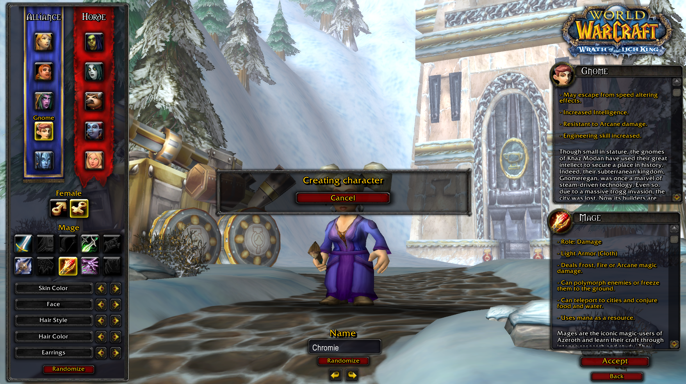
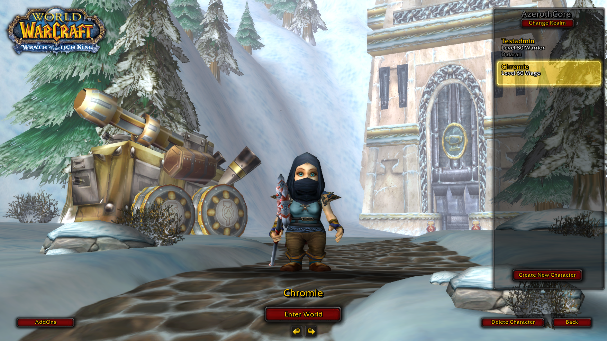
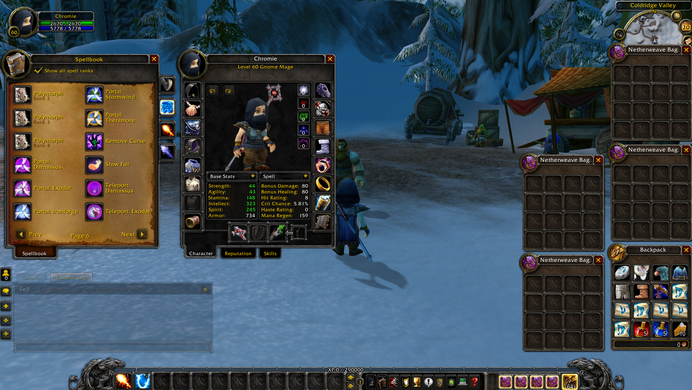

# Fast Forward - Character Pregeneration

A module for AzerothCore

## Description

This module allows for quick character generation for drop-in play or testing. After creating a reservation, the next matching character for the account will enter the world at the desired level, with:

- **Useable gear**: Dungeon and world drops already equipped
- **Abilities**: Core abilities already trained
- **Skills**: Core skills up-to-level
- **Mounts**: Appropriate mounts for level and zone
- **Bags**: A full complement of bags
- **Flight paths**: Flight paths already discovered

## How to install

Run the SQL manually or use the installer. Fast Forward requires a few new tables to track generation reservations.

## How to use this module

### Example

If you want to prep a level 60 frost mage, you might do the following:

```
ff prepfor archaicprose 24 60
```

This creates a reservation for your account that waits for the creation of a new mage character. This allows you to choose the race and appearance of your character in-game. On accepting your new mage, the reservation will be claimed and your mage will be fast-forwarded to level 60.

|||
|---|---|
|||
|||

### Spec Ids

The current implementation uses a `specid` to make decisions about items. These values are provided to nearly all fast-forward commands.

| Class | Spec | specid |
| --- | --- | --- |
| Warrior | Arms | 1 |
| | Fury | 2 |
| | Protection | 3 |
| Paladin | Holy | 4 |
| | Protection | 5 |
| | Retribution | 6 |
| Hunter | Beast Mastery | 7 |
| | Marksmanship | 8 |
| | Survival | 9 |
| Rogue | Assassination | 10 |
| | Combat | 11 |
| | Subtlety | 12 |
| Priest | Discipline | 13 |
| | Holy | 14 |
| | Shadow | 15 |
| Death Knight | Blood | 16 |
| | Frost | 17 |
| | Unholy | 18 |
| Shaman | Elemental | 19 |
| | Enhancement | 20 |
| | Restoration | 21 |
| Mage | Arcane | 22 |
| | Fire | 23 |
| | Frost | 24 |
| Warlock | Affliction | 25 |
| | Demonology | 26 |
| | Destruction | 27 |
| Druid | Balance | 28 |
| | Feral Combat (Cat) | 29 |
| | Restoration | 30 |
| | Feral Combat (Bear) | 99 |


### Console

In the Worldserver console, you can use the following commands to create fast-forward reservations for specific accounts.

```
ff prepfor <accountname> <specid> <level>
```

You can cancel all reservations for an account in a similar way.

```
ff cancelfor <accountname>
```

### In-Game

The in-game commands are much the same.

```
ff prep <specid> <level>
```
```
ff cancel
```


## Future Development

Still working on additional features, like:

- Professions
- Talents
- Better tuning and configuration for gear